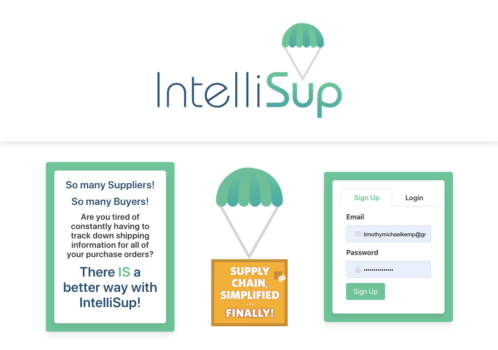
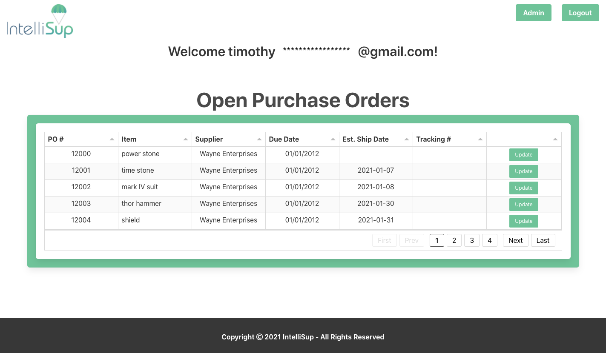
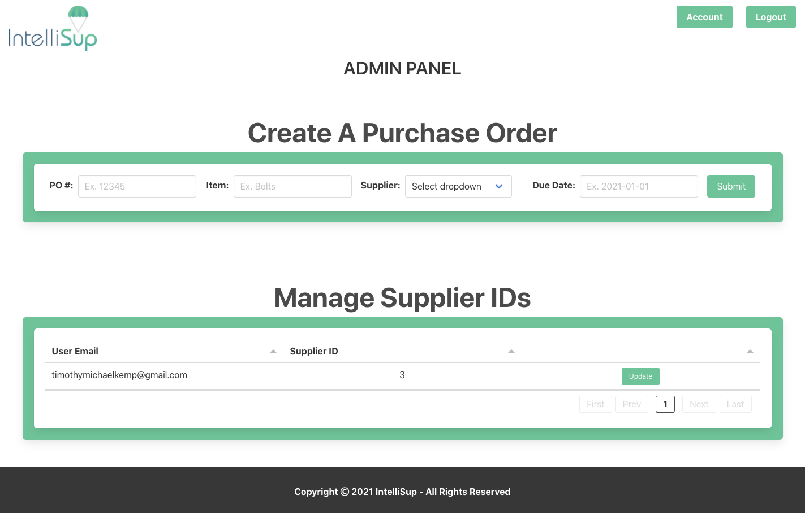

# IntelliSup

  [](https://opensource.org/licenses/MIT)

-----

## Table of Contents

* [Description](#description)
* [Installation](#installation)
* [Usage](#usage)
* [License](#license)
* [Contributing](#contributing)
* [Tests](#tests)
* [Questions](#questions)

-----

## Description

This program is the perfect application any of your supplier needs. The application is designed to allow user to make a new purchase order from suppliers. This order is then submitted into the database and displayed in the front end for the user to confirm information submitted. The application also allows the user to update tracking information and estimated ship date for each product.

This application is currently deployed on Heroku, and it can be accessed by clicking [here](https://intellisup.herokuapp.com/).

Example images:





-----

## Installation

Run the following command to install:

```npm i```

You will also need to use the provided schema.sql file to create the required database. Finally, you may need to update your connection information in the config.json file, depending on how you connect to MySQL.

-----

## Usage

Simply Sign Up with an email and password, then Login using the same credentials. Click on the Admin tab to access the form to create new purchase orders, which will then be displayed on the Account page. Suppliers ID mapping can also be adjusted on the Admin page to prevent specific users from accessing purchase orders not related to them.

-----

## License

This project is licensed under the terms of the **MIT License**. Please click the badge at the top of this README for specific details about the license.

-----

## Contributing

This application was built as part of a school project, and we are not accepting contribution requests at this time.

-----

## Tests

Sample data has been loaded to the deployed application, and it can be tested using the following sets of sample credentials:

**User 1:**

* Username: brucewayne@gmail.com
* Password: 123

**User 2:**

* Username: tonystark@gmail.com
* Password: 123

-----

## Questions

If you have any questions about this project, please free to contact us through our Github profiles below:

* GitHub: [IsraelGuillermo](https://github.com/IsraelGuillermo)
* GitHub: [mahbub798](https://github.com/mahbub798)
* GitHub: [mattyparty](https://github.com/mattyparty)
* GitHub: [timothykemp](https://github.com/timothykemp)
